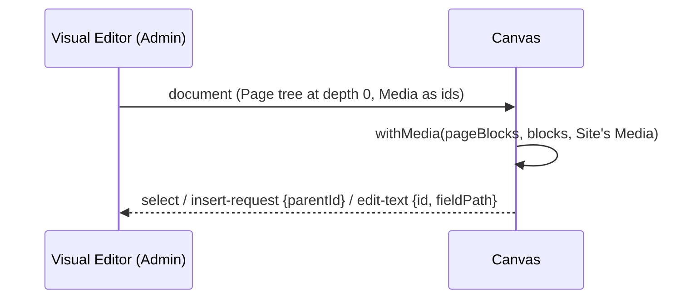

# Container Blocks: milestone/container-blocks into development

## Summary

Staff can put Blocks side by side and group them. A **Container** Block holds other Blocks as a stack or as columns, up to three levels deep (ADR-0007). Two small Blocks, **Button** and **Image**, come with it. The Visual Editor edits nested Blocks everywhere it edits top-level ones: state, Outline, Block tab, picker, canvas and save.

```text
Page
├── Hero
├── Container (2 columns, gap, alignment, Page or Reading width, background)
│   ├── Container (a card)            level 2
│   │   ├── Image
│   │   ├── Rich text
│   │   └── Button
│   └── Container (a card)
│       └── …
└── Call to action
```

What was built, by phase:

- **Phase 0–1:** ADR-0007, the spec (`docs/plans/container-blocks.md`), the glossary entry and the spike (`docs/plans/container-blocks-spike.md`).
- **Phase 2, schema and Site:**
  - The Container is written out three times in the config under one `blockType`, and level 3 takes no Container. There is a migration and generated types.
  - Each list's `validate` refuses a fourth level, a Block the list doesn't take, and a full-width-only Block in a column, and the message names the place.
  - Containers render as a grid on their own surface. The Blocks inside drop their band, padding and page-width box under the `data-container` mark.
  - A Block's ids come from its path (`block-1-0-2-heading`).
  - Button and Image Blocks were added, each with a catalogue entry, sample and thumbnail.
  - Each catalogue entry says whether it `fitsNarrow`.
  - "Pages linking here" and Media-in-use read nested Blocks.
- **Phase 3, editor core:**
  - The editor's document is a tree. Find, insert, move, duplicate, remove and undo work by id at any depth, and depth and fit are checked on insert and move.
  - The Block tab edits a nested Block and names where it is.
  - The picker offers only what fits where the Block goes.
  - Save problems name a nested Block by its place ("Block 2, Container, Column 1").
- **Phase 4, Outline and the Tuck-in starter:**
  - The Outline is a tree. Containers collapse and expand.
  - Drag and drop works within, into, out of and between Containers. A refused drop says why.
  - Two row buttons, "into the Container above" and "out of its Container", move a Block without dragging.
  - The Tuck-in starter is rebuilt as two Containers, each holding a Rich text with a Button under it.
- **Phase 5, canvas:**
  - The canvas frames Blocks at any depth. A click selects the innermost Block, the label shows its path, and Esc goes up a level.
  - "+" buttons sit between a Container's Blocks, and an empty Container has an "Add a Block" button.
  - Text is edited in place at any depth. The bridge names a Block by id.
- **Phase 6, narrow fit:** these Blocks now lay themselves out with the `fit-*` breakpoints: Features, Stats, Image + text, Steps, Amenities, FAQ, Newsletter and Form. On the Page, `fit-*` is the viewport's `sm`/`md`/`lg`/`xl`. Inside a Container it is the cell's width. Each Block is marked as fitting, with screenshots at one half and one third.
- **Phase 7, audit fixes:** three reviewers audited the branch. Their findings were fixed as follows:
  - The catalogue e2e counts Button and Image.
  - Duplicate strips row ids at any depth, so a duplicated Container publishes.
  - The Call to action is on `fit-*`.
  - Inside a Container, a Block is a region only when its own heading names it, and a card is a `group`.
  - The canvas draws images from the Media ids the editor holds. An Image Block with no image is a box that says to choose one.
  - A Container at Reading width counts as narrow.
  - The Outline tree is one tab stop. Space selects a row and keeps focus on it. Enter or a click moves focus into the Block tab.
  - The Admin look baseline was photographed again.



## Evidence

- **Before (audit at 69331d2):**
  - `pnpm --filter site test:e2e` failed in `4-blocks/catalogue` (`expected 22 to be 20`) and in 3 `theme/admin-look` screens.
  - An Image Block in the canvas was 0x0 with no ``.
  - Publishing a duplicated Container gave `id: Value must be unique`.
  - A two-card grid on `/our-homes` gave 11 regions, including "Section 2.1.2".
  - The Outline took 36 Tab stops on a 10-row Page.
  - Space on a row dropped focus to `<body>`.
- **After:**
  - `pnpm --filter site lint` and `pnpm --filter site typecheck` pass (exit 0).
  - `pnpm --filter site test`: 167 files and 2953 tests pass.
  - E2E: see "E2E run" below.
  - New tests that failed before their fix and pass after it:
    - `state.test.ts`: a duplicate's Features rows have no ids, at the top level and inside a Container.
    - `narrowFit.test.tsx`: no Block on the Page uses a container query of its own.
    - `blockPlace.test.tsx`: a row of cards has no region per Block, and each card is a group.
    - `withMedia.test.ts` and `EditorCanvas.test.tsx`: an image named by Media id is drawn, at any depth.
    - `ButtonImageBlocks.test.tsx`: an empty Image Block shows a placeholder while editing.
    - `e2e/7-container-blocks/images.e2e.ts`: the image and the placeholder show in a real canvas, and a click selects the placeholder (failed with the fix stashed).
    - `container.test.ts` and `state.test.ts`: Reading width refuses a full-width-only Block on save, on move and in the picker.
    - `OutlinePanel.test.tsx` and `PageMode.test.tsx`: there is one tab stop, the arrow keys work from a row's buttons, Space keeps focus on the row, and Enter or a click puts focus in the Block tab.
- Audit screenshots: `docs/screenshots/8-container-blocks/audit/`. Narrow-fit screenshots: `docs/screenshots/8-container-blocks/narrow/`.

### E2E run

This is the full `pnpm --filter site test:e2e` run after the fixes, on scratch database `pm_container_blocks`, with `E2E_PORT=3231` and `E2E_SITES_PORT=3271`. It took 1153s.

- Test files: 36 passed, 1 failed, out of 37.
- Tests: 792 passed, 1 failed, 14 skipped, out of 807.
- The 14 skips are `e2e/6-seed-sites/2-sites` `it.runIf` cases, which are expected.
- The one failure: `e2e/5-visual-editor/shell.e2e.ts > opens a Page at /admin/pages/[id]`, a 30s `page.goto` timeout while the route compiled.
- Re-running that file alone: 22 of 22 pass.
- `catalogue.e2e` passes 63 of 63. `admin-look` passes 7 of 7. The new `7-container-blocks/images.e2e` passes 2 of 2.
- The run rewrote some screenshots, which were not committed. In `2-theme/presets` and `restore` only the footer differs, from the scratch database's Layout. The Call to action band is pixel-identical, which confirms the `fit-*` move left the top level unchanged.

## Merge Danger

**Door:** one-way for the schema, two-way for the rest.

Two migrations add tables: `pages_blocks_container`, `_2` and `_3`, `pages_blocks_button`, `pages_blocks_image`, and their `_pages_v_` copies. They only create tables, but once Staff store Containers, rolling back drops their content. The rendering and editor changes can be reverted with no data loss.

**Blast Radius:** wide.

- Every Block's ids and region names inside Containers changed. Top-level ids and names are unchanged.
- Nine Blocks moved from viewport breakpoints to `fit-*`. At the top level, `fit-*` is the same media query by construction.
- The editor document, the Outline, the canvas bridge (`edit-text` now addresses a Block by id) and save validation all changed.
- Existing Pages are unaffected unless they hold a Block in a one-column Container; see the stacks decision below.

## Decisions made during the build

### Phase 2

- Table names are not pinned with `dbName`. `dbName` on a Block replaces the whole table name, and Payload keeps one name per slug per collection, so the three levels would share one table and lose the tree. Payload numbers the tables by nesting (`pages_blocks_container`, `_2`, `_3`). A test holds the six names, and ADR-0007 says so.
- Columns is a select with the values "1" to "4", stored as an enum.
- Defaults: columns "1", gap "medium", align "top" (top / centre / stretch), width "page" (page / reading), background default.
- A Block inside a Container doesn't paint its own background; it is drawn for the Container's surface.
- A nested Container paints only a background other than Default, as a card. On Default it sits on the outer Container's surface.
- A Hero with a photo inside a Container keeps the photo as a rounded card. Without a photo it takes the Container's colours.
- Each child sits in a cell that is its own `@container`. A cell whose Block renders nothing takes no room.
- Gap is in steps of `--section-y` (0.4, 0.8, 1.2). Reading width is `max-w-3xl`, left-aligned.
- Columns change by container query: 2 from 24rem, 3 from 48rem, 4 from 64rem of the Container's own width.
- Refusal messages name a Block by its place from the top. The rule is a `validate` on the Page's `blocks` field and on each level's `children` field.
- The Container's catalogue entry sits in the "Content" group, last in the picker.
- The dev catalogue page takes `?container=<background>` and `?columns=2..4`.
- Ids use an optional `within` on the context next to `index`.
- Button and Image have no background field.
- A Primary Button on a Primary or Dark surface is drawn inverted. Outline always has a 1px edge.
- The Image field is optional. Its shapes are original / 16x9 / 4x3 / 1x1. Original with no known size (an SVG) falls back to 4:3.
- The fit rule looks at ancestors: a stack inside columns is narrow.
- Nested places say "Column N" in a Container with columns and "Block N" in a stack. N counts cells in order.
- `pagesLinkingTo` reads Hero, Call to action and Button links at any depth.
- PAGE_BLOCKS (the Phase 4 e2e list) stays at twenty Blocks. Button and Image are in SMALL_BLOCKS.
- The Call to action stays `fitsNarrow: true`.

### Phase 3

- The reducer refuses a bad place by returning the same state. `placementProblem` gives the reason.
- Depth and fit are checked on insert and move. A Columns change while a Container holds a full-width Block is caught only on save.
- `moveBlock` gained an optional `parentId`, and `moveBlockTo` moves a Block between lists.
- Place names are shared by the Block tab, the save field errors and the server's refusals. Top-level save problem names are unchanged.
- A row's own buttons don't select the row (one guard in `onClick`).

### Phase 4

- Tuck-in starter links: "Learn More" goes to `/owners` and "Explore Our Properties" to `/rentals`, as placeholders. The Containers use the catalogue defaults.
- Dragging changes level like an outliner: 16px sideways per level. A Block drops only into an open Container, and a dragged Container hides its own Blocks.
- The row under the pointer is a DragOverlay copy, so the row in the list can show where the Block will land.
- A refused drop shows its reason in red under the list and announces it.
- Move up and down stay within a list. "Into the Container above" and "out of its Container" are separate buttons (WCAG 2.5.7). "Into" stays visible when it would be refused, and a click explains why.
- Rows wrap their buttons at narrow panel widths.

### Phase 5

- Every canvas request names a Block by id. `edit-text` is `{id, fieldPath, value}`.
- A Container puts the frame attributes on its grid cells, so `align: stretch` still reaches the Block.
- Esc goes up one level everywhere.
- The canvas label joins catalogue names with " › ".
- Next to a Block that has a sibling beside it, "+" reads "before/after"; otherwise "above/below".
- When a "+" of the selected Block would cover one of the hovered Block's, only the hovered Block's is drawn (`PLUS_SIZE` 24px).
- `samples.test` skips the Container's editing-versus-Site markup comparison. `ContainerBlock.test` covers it.

### Phase 6

- `fit-sm`, `fit-md`, `fit-lg` and `fit-xl` (in `packages/ui` globals.css) are `@media` queries outside `[data-container]` and `@container` queries inside it. The top level is unchanged by construction.
- Inside a Container the thresholds are measured against the cell's content width. A half column at 1280 (about 586px) falls just under `fit-sm`, so Features, Steps, Stats, Newsletter and Form use their one-column layout there.
- **This also changes existing stacks.** A Block in a one-column Container now sizes itself against the cell, not the viewport. At 1024, a page-width stack gives Features 2 columns where the top level has 3, and Steps and Stats get 2 where the top level has 4.
- `md:text-sm` on the shared Input and Textarea stays; it changes no layout.
- next/image `sizes` still describes the viewport layout.

### Phase 7 (audit fixes)

- The catalogue e2e checks names and paths for PAGE_BLOCKS plus SMALL_BLOCKS: 22 pages.
- Duplicate uses `withoutRowIds`, moved to `src/fields/rowIds.ts`, which drops every string `id` in the copy. The Block ids are minted again afterwards.
- The Call to action uses `fit-sm`/`fit-md`/`fit-lg` in place of `@xl`/`@2xl`/`@4xl`, and drops its own `@container` box.
- Regions: inside a Container, `BlockSection`'s fallback `label` names nothing. A Block there is a region only when its own heading labels it (`aria-labelledby`). A Container inside a Container (a card) is `role="group"`, unnamed. The top-level Container is still a plain div, and top-level Blocks keep their names.
- The canvas fills Media ids from the Site's whole Media library. `EditingPage` reads it (`getMediaLibrary`, as a visitor) and `withMedia` walks the data alongside `pageBlocks`' config.
- An Image Block with no image renders a placeholder only while editing; on the Site it still renders nothing.
- A Button with an empty label or link still renders nothing in the canvas, as do other Blocks without their required text (a Call to action without a heading). The Button starts with catalogue defaults, so it only disappears when Staff clear its label or link.
- Reading width counts as narrow, following ADR-0007's "narrower than the page". This reverses the Phase 2 decision. The server message now ends "Move it out of the Container, or set the Container to 1 column at Page width." The editor's message is unchanged.
- Outline keyboard:
  - The tab stop follows the row focus was last in; a new selection resets it.
  - Only that row's buttons are in the Tab order.
  - Up, Down, Home and End work from a row's buttons as from the row.
  - Space selects and stays on the row. Enter and click select and open the Block tab.
  - `LeftPanel` moves focus into the new tab's panel when the tab changes under focus that would otherwise be lost (on `<body>` or in the panel being left).
- The Admin look baseline (pages-empty, brand, seo) was photographed again the way the test's header describes. The 10 `packages/ui` components that existed at `checkpoint/1-foundation` were swapped back to that version, and the components added since were kept. Those screens' content had changed on development (the Page Templates button, the Brand logo picker). The 4 screens whose content didn't change came out byte-identical, which checks the method.

## Known gaps

- Not checked with a real screen reader. Keyboard and focus behaviour is covered by jsdom tests and the Outline e2e.
- A Button with an empty label or link renders nothing in the canvas, and can then only be selected from the Outline.
- The canvas loads the whole Media library on every editing load, with no pagination.
- Several "+" buttons and "Add a Block to this Container" buttons share a name.
- Payload's own admin (`/p-admin`) shows the fit rule only after Save, because its form state calls `validate` without `path`.
- The Rental grid's filter chips fail contrast (1.05:1) on the Primary and Dark surfaces when the Site has Rentals. This predates the branch, and the axe checks run without fixtures so they miss it.

## Backlog

- A Page whose first Block is a Container has no h1. Decide whether a Container at index 0 hands "first" to its first Block.
- An Image Block that is first on a Page is not preloaded.
- Change Columns while a Container holds a full-width Block: show the problem as an inline field error, not only on save.
- `moveBlockTo` and `placementProblem` don't check a region's own catalogue (a Header Block could move into the Footer). This needs a check before any other caller uses `moveBlockTo`.
- A Container that becomes empty while collapsed stays collapsed and can't take a drop.
- The Outline reserves the toggle slot for the whole Region. The refusal text stays after Undo. `aria-setsize` and `aria-posinset` are not set. Toggle and "Move Container up" labels are the same for every Container.
- Row hints don't tell Containers apart, nor Rich text Blocks stored as Lexical (the Tuck-in Outline shows "Container / Rich text / Button" twice).
- A sideways drag that changes the landing level isn't announced until the row under the pointer changes.
- When two nested Containers have the same box, a click can't select the outer one.
- A half column at 1280 falls just under `fit-sm`; consider whether halves should get the two-column layouts.
- Fix the next/image `sizes` for a column. `fit-xl` is unused.
- Browser checks of each `fitsNarrow` Block in 2, 3 and 4 columns at tablet and desktop widths.
- `refusal()` for a row with no `blockType` says "“undefined” Block".
- A tsx script that imports `src/payload.config` and calls `buildPayloadConfig()` again fails in `setColumnID`. This predates the branch; `scripts/seed.ts` is not affected.
- `bridge.ts`'s header comment splits its message table, and one doc line in `useCanvasBridge.ts` is over-long.
- ADR-0007 and the spec don't mention the `fit-*` variants, and the spec's 2.1 still says "pinned table names".

🤖 Generated with [Claude Code](https://claude.com/claude-code)
